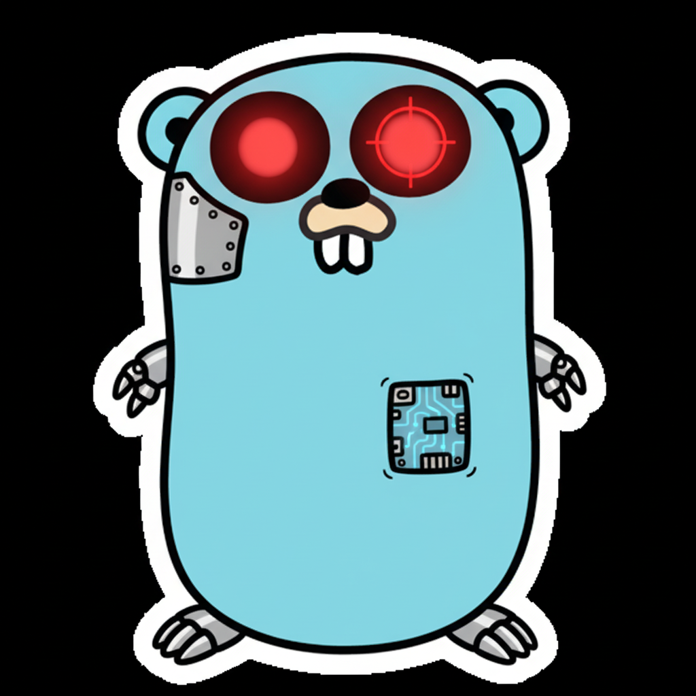

# gopher-ai

<div align="center">
  
</div>

A simple Go Agentic framework for building AI agents.

## Installation

```bash
go get github.com/marti-jorda-roca/gopher-ai/gopherai
```

## Build

```bash
go build ./gopherai
```

## Run Example

```bash
export OPENAI_API_KEY="your-api-key"
go run example/openai_basic.go
```

## Lint & Format

```bash
golangci-lint run --fix
```
